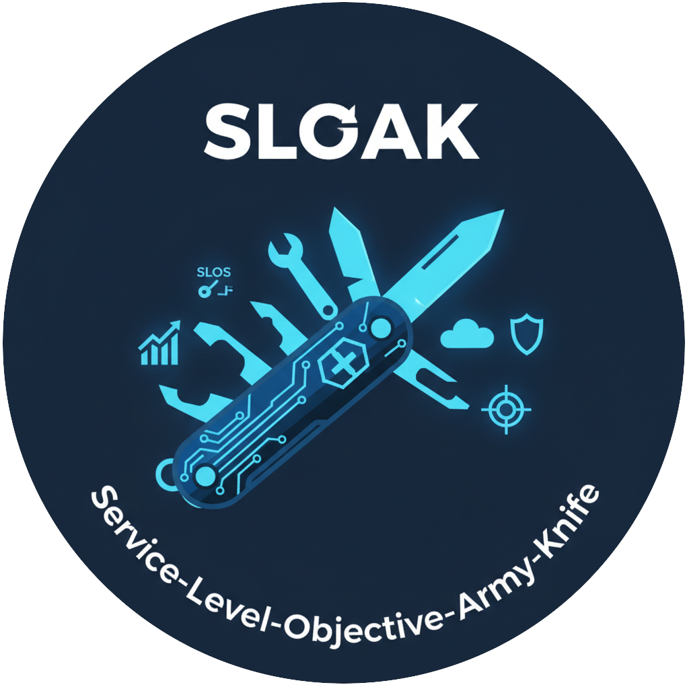

# SLOAK: Service-Level-Objective Army Knife

 

`sloak` is a command-line tool designed to simplify Service Level Objective (SLO) engineering. It provides utilities for calculating error budgets, burn rates, feasibility, and more, helping SREs and developers build more reliable systems.

Inspired by the [Google SRE Workbook](https://sre.google/workbook/implementing-slos/).

---

## 🚀 Getting Started

The easiest way to start is by calculating an error budget for a standard SLO.

```bash
# Calculate 99.9% SLO over 30 days
sloak calculate errorbudget --slo 99.9 --window 30d

# Get machine-readable JSON for Prometheus/Automation
sloak calculate errorbudget --slo 99.9 --window 30d --output json
```

### Common Commands

- **Calculate Burn Rate**: See how fast you're consuming your budget.
  ```bash
  sloak calculate burnrate --slo 99.9 --window 30d --elapsed 7d --consumed 30m
  ```
- **Feasibility Analysis**: Check if your MTTR is realistic for your SLO.
  ```bash
  sloak calculate feasibility --slo 99.9 --mttr 1h
  ```
- **Max Disruption**: Calculate how many deployments you can afford.
  ```bash
  sloak calculate max-disruption --slo 99.9 --cost 2m
  ```
- **Prometheus Alert Rules**: Generate MWMBR alert rules for Prometheus Operator.
  ```bash
  sloak generate prometheus --slo 99.9 --metric-name checkout_flow --rule-labels "team=billing"
  ```

---

## 🛠 Installation & Building

### Building from Source
```bash
# Clone the repository
git clone https://github.com/MichielVanderhoydonck/sloak.git
cd sloak

# Build the binary
go build -o sloak cmd/sloak/main.go

# (Optional) Install to your GOBIN
go install ./cmd/sloak
```

---

## 📖 Command Reference

| Command | Description |
|---------|-------------|
| `calculate errorbudget` | Allowed failure time for a given SLO and window. |
| `calculate burnrate` | Current budget consumption speed and exhaustion forecast. |
| `calculate feasibility` | Required MTBF given a target SLO and MTTR. |
| `calculate dependency` | Composite availability for serial/parallel systems. |
| `calculate max-disruption` | Frequency limits based on deployment disruption cost. |
| `convert` | Translate between availability % and downtime duration. |
| `generate alert-table` | Generate a standard multi-window, multi-burn-rate alert table. |
| `generate prometheus` | Generate production-ready Prometheus MWMBR alert rules. |

### Global Flags
- `-o, --output string`: Set output format. Use `json` for machine-readable data (useful for Prometheus alerting config).

---

## 🏗 Architecture & Linting

`sloak` follows **Clean Architecture** principles. Each command is self-contained in the `cmd` directory, with domain logic and services separated in `internal/core`.

### Architecture Linting
We use `go-arch-lint` to enforce architectural boundaries.
```bash
docker run --rm -v ${PWD}:/app fe3dback/go-arch-lint:latest-stable-release check --project-path /app
```

---

## 🧪 Testing

### Unit & Service Tests
```bash
go test ./...
```

### End-to-End (E2E) Tests
Verified against the actual compiled binary.
```bash
go test -v -tags=e2e ./test/e2e
```

---
